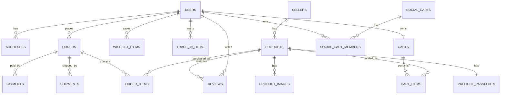

# Database And API Specification

## 1. Suggested Database

PostgreSQL is recommended because the project needs transactions, relational data, reporting, and order consistency.

## 2. Entity Relationship Diagram



## 3. Core Tables

### 3.1 users

| Column | Type | Notes |
| --- | --- | --- |
| id | uuid | Primary key |
| full_name | varchar | Required |
| email | varchar | Unique |
| phone | varchar | Optional |
| password_hash | text | Required |
| role | enum | customer, seller, admin, delivery, support |
| status | enum | active, blocked, pending |
| created_at | timestamp | Default now |

### 3.2 sellers

| Column | Type | Notes |
| --- | --- | --- |
| id | uuid | Primary key |
| user_id | uuid | FK users.id |
| store_name | varchar | Required |
| business_type | varchar | Individual, company, brand |
| trust_score | integer | 0 to 100 |
| verification_status | enum | pending, approved, rejected |
| commission_rate | numeric | Platform commission |

### 3.3 products

| Column | Type | Notes |
| --- | --- | --- |
| id | uuid | Primary key |
| seller_id | uuid | FK sellers.id |
| category_id | uuid | FK categories.id |
| title | varchar | Required |
| slug | varchar | Unique |
| description | text | Required |
| price | numeric | Required |
| compare_at_price | numeric | Optional |
| stock_quantity | integer | Required |
| rating_average | numeric | Default 0 |
| rating_count | integer | Default 0 |
| status | enum | draft, pending, active, rejected, paused |
| resale_eligible | boolean | Default false |
| created_at | timestamp | Default now |

### 3.4 product_passports

| Column | Type | Notes |
| --- | --- | --- |
| id | uuid | Primary key |
| product_id | uuid | FK products.id |
| authenticity_status | enum | verified, unverified, rejected |
| warranty_months | integer | Required |
| repairability_score | integer | 0 to 100 |
| carbon_score | integer | 0 to 100 |
| estimated_resale_percent | integer | 0 to 100 |
| return_risk | enum | low, medium, high |
| passport_notes | text | Optional |

### 3.5 carts

| Column | Type | Notes |
| --- | --- | --- |
| id | uuid | Primary key |
| user_id | uuid | FK users.id |
| status | enum | active, converted, abandoned |
| created_at | timestamp | Default now |
| updated_at | timestamp | Default now |

### 3.6 cart_items

| Column | Type | Notes |
| --- | --- | --- |
| id | uuid | Primary key |
| cart_id | uuid | FK carts.id |
| product_id | uuid | FK products.id |
| quantity | integer | Required |
| unit_price | numeric | Snapshot price |

### 3.7 orders

| Column | Type | Notes |
| --- | --- | --- |
| id | uuid | Primary key |
| user_id | uuid | FK users.id |
| order_number | varchar | Unique |
| subtotal | numeric | Required |
| discount_total | numeric | Default 0 |
| shipping_total | numeric | Required |
| tax_total | numeric | Required |
| grand_total | numeric | Required |
| status | enum | pending, confirmed, packed, shipped, delivered, cancelled, returned |
| delivery_type | enum | fast, standard, delay_to_save |
| created_at | timestamp | Default now |

### 3.8 social_carts

| Column | Type | Notes |
| --- | --- | --- |
| id | uuid | Primary key |
| owner_user_id | uuid | FK users.id |
| title | varchar | Required |
| target_members | integer | Required |
| current_discount_percent | integer | Default 0 |
| expires_at | timestamp | Required |
| status | enum | active, completed, expired |

### 3.9 trade_in_items

| Column | Type | Notes |
| --- | --- | --- |
| id | uuid | Primary key |
| user_id | uuid | FK users.id |
| product_id | uuid | FK products.id |
| order_item_id | uuid | FK order_items.id |
| original_price | numeric | Required |
| estimated_value | numeric | Required |
| condition_status | enum | new, good, fair, damaged |
| trade_status | enum | eligible, requested, approved, rejected, credited |

## 4. API Endpoints

Base URL:

```text
/api/v1
```

### 4.1 Authentication

| Method | Endpoint | Purpose |
| --- | --- | --- |
| POST | `/auth/register` | Create new user |
| POST | `/auth/login` | Login user |
| POST | `/auth/logout` | Logout user |
| POST | `/auth/refresh` | Refresh access token |
| POST | `/auth/forgot-password` | Send reset OTP |
| POST | `/auth/reset-password` | Reset password |

### 4.2 Products

| Method | Endpoint | Purpose |
| --- | --- | --- |
| GET | `/products` | List products with filters |
| GET | `/products/:slug` | Get product detail |
| POST | `/seller/products` | Seller creates product |
| PATCH | `/seller/products/:id` | Seller updates product |
| DELETE | `/seller/products/:id` | Seller deletes or pauses product |
| GET | `/products/:id/passport` | Get product passport |

Example product list query:

```text
GET /api/v1/products?category=home-office&minPrice=20&maxPrice=200&trustScore=80&resaleEligible=true
```

### 4.3 Cart And Checkout

| Method | Endpoint | Purpose |
| --- | --- | --- |
| GET | `/cart` | Get active cart |
| POST | `/cart/items` | Add item to cart |
| PATCH | `/cart/items/:id` | Update item quantity |
| DELETE | `/cart/items/:id` | Remove item |
| POST | `/checkout/quote` | Calculate totals |
| POST | `/checkout/place-order` | Create order |

### 4.4 Orders

| Method | Endpoint | Purpose |
| --- | --- | --- |
| GET | `/orders` | Customer order history |
| GET | `/orders/:id` | Order detail |
| PATCH | `/seller/orders/:id/status` | Seller updates order status |
| POST | `/orders/:id/cancel` | Cancel order |
| POST | `/orders/:id/return` | Request return |

### 4.5 AI Concierge

| Method | Endpoint | Purpose |
| --- | --- | --- |
| POST | `/ai/cart-plan` | Generate product bundle from user goal |
| POST | `/ai/product-alternatives` | Suggest cheaper or premium alternatives |
| POST | `/ai/seller-growth-tips` | Suggest seller improvements |

Example request:

```json
{
  "goal": "Build a compact work-from-home desk setup",
  "budget": 350,
  "preferences": ["space saving", "resale eligible", "fast delivery"]
}
```

Example response:

```json
{
  "summary": "A compact setup with strong resale value and delivery within 3 days.",
  "items": [
    {
      "productId": "prd_101",
      "reason": "Adjustable height and verified seller trust score above 90."
    }
  ],
  "estimatedTotal": 318.5,
  "estimatedSavings": 41.0
}
```

### 4.6 Social Cart

| Method | Endpoint | Purpose |
| --- | --- | --- |
| POST | `/social-carts` | Create group-buy cart |
| GET | `/social-carts/:id` | View group cart |
| POST | `/social-carts/:id/join` | Join group cart |
| POST | `/social-carts/:id/checkout` | Checkout group cart |

### 4.7 Trade-In Wallet

| Method | Endpoint | Purpose |
| --- | --- | --- |
| GET | `/trade-in-wallet` | View eligible products |
| POST | `/trade-in-wallet/:id/request` | Request trade-in |
| PATCH | `/admin/trade-ins/:id/status` | Admin updates trade-in status |

## 5. Security Requirements

- Store passwords using bcrypt or Argon2.
- Use access and refresh tokens.
- Protect seller and admin APIs using role checks.
- Validate request body using schemas.
- Rate-limit login and OTP requests.
- Store payment tokens with payment provider, not in the local database.
- Use signed URLs for private product documents.
- Log admin actions for audit.

## 6. Backend Services

| Service | Responsibility |
| --- | --- |
| Auth Service | Registration, login, token refresh, role permissions. |
| Catalog Service | Products, categories, search filters, product passport. |
| Cart Service | Cart items, coupons, checkout quote. |
| Order Service | Orders, order items, shipment status, returns. |
| AI Service | Recommendations, cart planning, seller suggestions. |
| Seller Service | Seller onboarding, products, analytics, inventory. |
| Admin Service | Approval, moderation, disputes, platform analytics. |
| Wallet Service | Trade-in credit and wallet balance. |

## 7. Example Status Values

Order statuses:

```text
pending -> confirmed -> packed -> shipped -> out_for_delivery -> delivered
```

Return statuses:

```text
requested -> approved -> picked_up -> inspected -> refunded
```

Trade-in statuses:

```text
eligible -> requested -> picked_up -> inspected -> approved -> credited
```

