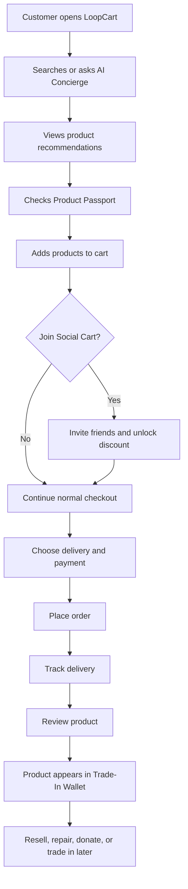

# LoopCart Project Documentation

## 1. Project Overview

LoopCart is a next-generation ecommerce marketplace where users can buy products, receive AI recommendations, join group-buy deals, verify authenticity, and trade products back into a resale wallet.

The project is designed for a market where customers want lower prices, trusted sellers, faster discovery, and more sustainable shopping. LoopCart avoids being just another product catalog by making the buying journey smarter before purchase and more valuable after purchase.

## 2. Problem Statement

Current ecommerce platforms often have these problems:

- Too many choices make customers confused.
- Product trust is weak because reviews can be fake or incomplete.
- Customers do not know whether a product is authentic, repairable, returnable, or resellable.
- Sellers struggle to understand why products are not converting.
- Most platforms end after checkout and do not help customers reuse, resell, or trade in products.
- Customers want better prices, but normal coupons are not personalized.

## 3. Proposed Solution

LoopCart solves these issues with a circular commerce model:

1. Customer describes what they need.
2. AI Cart Concierge suggests products, bundles, and cheaper alternatives.
3. Customer checks Product Passport for authenticity, seller trust, warranty, return rules, and resale estimate.
4. Customer can join a group-buy deal for extra savings.
5. Customer chooses fast delivery or Delay-To-Save delivery.
6. After purchase, the product appears in the Trade-In Wallet.
7. Customer can resell, exchange, repair, or donate the item later.

## 4. Project Objectives

- Build a complete ecommerce system with customer, seller, and admin roles.
- Improve product discovery using AI-powered suggestions.
- Increase trust with product passports and seller trust scores.
- Encourage repeat usage through trade-in wallet and resale credit.
- Support group buying, personalized offers, order tracking, reviews, and returns.
- Provide sellers with inventory, analytics, and growth recommendations.

## 5. Target Audience

- Urban online shoppers who want quick discovery and reliable products.
- Budget-conscious customers who like deals, bundles, and resale value.
- Eco-aware customers who prefer sustainable choices.
- Small and medium sellers who need better digital selling tools.
- Students and young professionals who enjoy social shopping and group-buy discounts.

## 6. Unique Market Features

| Feature | What It Does | Why It Can Click In The Market |
| --- | --- | --- |
| AI Cart Concierge | Builds a full cart from user goals, budget, style, size, and delivery preference. | Reduces browsing time and gives a personal shopping feel. |
| Product Passport | Shows authenticity, warranty, repairability, return risk, seller trust, and resale eligibility. | Builds trust before purchase. |
| Trade-In Wallet | Estimates future resale value and lets customers trade products for wallet credit. | Creates repeat purchases and circular commerce. |
| Social Cart | Users invite friends to unlock a group discount. | Makes shopping viral and community driven. |
| Delay-To-Save Delivery | Slower delivery gives shipping discount and lower carbon score. | Converts sustainability into visible savings. |
| Smart Bundle Builder | AI creates bundles based on occasion, budget, compatibility, and seller offers. | Increases average order value. |
| Seller Growth Studio | Gives sellers AI suggestions for pricing, inventory, photos, offers, and return reduction. | Helps small sellers grow instead of only listing products. |
| TrustScore | Combines delivery accuracy, return rate, review quality, product authenticity, and support response. | Makes seller quality visible. |

## 7. Scope

### In Scope For MVP

- User registration and login
- Product listing and categories
- Product search and filters
- Product detail page
- Cart and wishlist
- Checkout flow
- Order placement and tracking
- Reviews and ratings
- AI concierge mock flow
- Product passport
- Group-buy deals
- Trade-in wallet estimate
- Seller dashboard
- Admin dashboard

### Out Of Scope For MVP

- Real payment gateway integration
- Real-time delivery partner GPS tracking
- Real AR try-on implementation
- Machine learning model training
- Warehouse management automation
- Live chat with human agents

These can be added in later phases.

## 8. User Roles

| Role | Responsibilities |
| --- | --- |
| Customer | Browse, search, add to cart, checkout, review, track orders, trade in products. |
| Seller | Add products, manage inventory, update prices, view orders, manage returns, see analytics. |
| Admin | Approve sellers, manage categories, monitor orders, handle disputes, view platform analytics. |
| Delivery Partner | Accept delivery tasks, update shipment status, confirm delivery. |
| Support Agent | Handle customer complaints, refund issues, and seller disputes. |

## 9. Main Modules

### 9.1 Authentication Module

- Sign up using name, email, phone, and password.
- Login using email and password.
- Role-based dashboard routing.
- Password reset using email OTP.
- JWT-based session management.

### 9.2 Product Catalog Module

- Product categories and subcategories.
- Product cards with image, price, rating, seller, delivery estimate, and sustainability score.
- Filters for price, brand, rating, color, size, seller trust, availability, delivery speed, and resale eligible products.
- Search with spelling tolerance and suggested keywords.

### 9.3 AI Cart Concierge Module

- User enters goal such as "home office setup under $500".
- System suggests products, bundles, and cheaper alternatives.
- User can apply suggestions directly to cart.
- AI explains why each item was recommended.

### 9.4 Product Passport Module

- Authenticity status.
- Seller TrustScore.
- Warranty duration.
- Return window.
- Repairability score.
- Estimated resale value.
- Carbon score.
- Quality checklist.

### 9.5 Cart And Checkout Module

- Add and remove products.
- Quantity update.
- Coupon and wallet credit.
- Delivery method selection.
- Address selection.
- Payment method selection.
- Order summary and confirmation.

### 9.6 Social Cart Module

- Customer creates a group-buy cart.
- Customer shares invite link.
- More participants unlock higher discount tiers.
- Cart expires after a fixed time.

### 9.7 Trade-In Wallet Module

- Purchased products appear in wallet.
- System estimates future resale value.
- User can request trade-in pickup.
- Approved trade-in value becomes wallet credit.

### 9.8 Seller Dashboard Module

- Product management.
- Inventory status.
- Orders and returns.
- Revenue analytics.
- TrustScore breakdown.
- AI growth recommendations.

### 9.9 Admin Dashboard Module

- User and seller management.
- Product approval.
- Category management.
- Order monitoring.
- Refund and dispute control.
- Platform analytics.

## 10. High-Level Working Flow

## 11. Recommended Development Phases

### Phase 1: MVP

- Static frontend screens
- Product listing
- Product detail
- Cart and checkout
- Seller dashboard
- Admin dashboard
- Mock AI suggestions

### Phase 2: Backend

- Authentication
- Product CRUD
- Order APIs
- Cart persistence
- Database integration
- Role-based access

### Phase 3: Advanced Features

- Real recommendation engine
- Payment gateway
- Group-buy invite links
- Trade-in request workflow
- Delivery tracking

### Phase 4: Market-Ready Version

- Mobile app
- AR preview
- Real seller onboarding
- Customer support workflow
- Analytics and fraud detection

